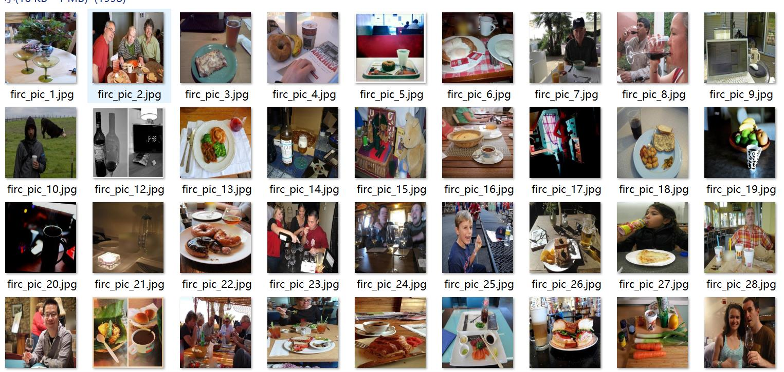
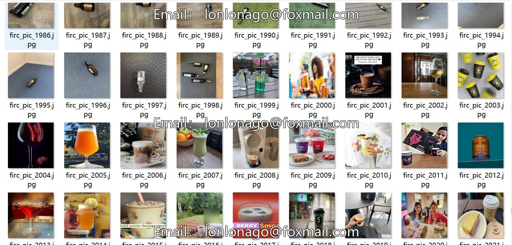
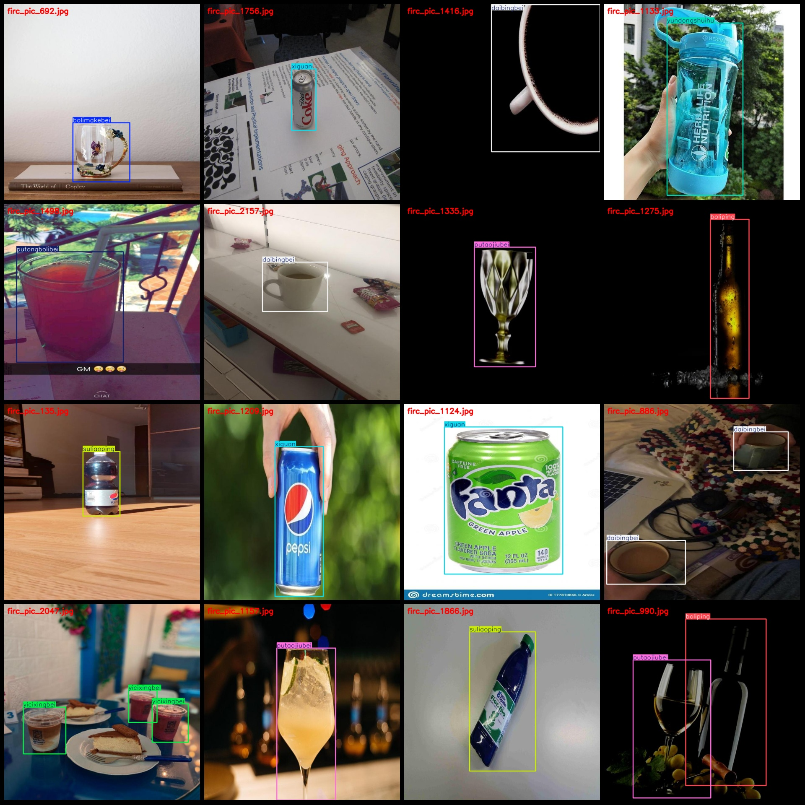
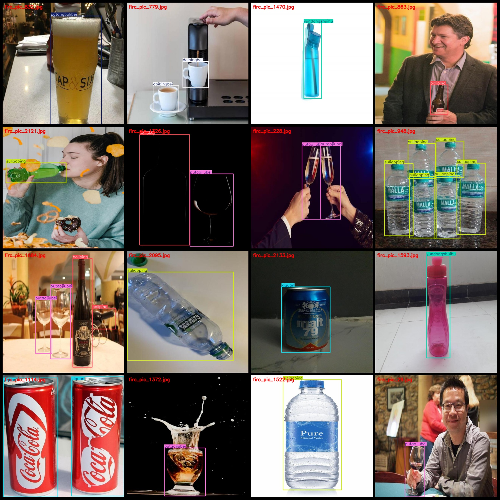

# Drink Bottle and Can Sorting Dataset: VOC+YOLO format with 2716 images in 9 categories

The dataset consists of 2716 images labeled with 9 categories in Pascal VOC format and YOLO format. The format does not include a split path in the txt file, but only includes the JPG images along with their corresponding VOC and YOLO txt files.

- Image count (JPG files): 2176
- Annotation count (XML files): 2176
- Annotation count (txt files): 2176
- Number of categories: 9
- Category names according to the yolo format: ["bolimakebei", "boliping", "daibingbei", "putaojiubei", "putongbolibei", "suliaoping", "xiguan", "yicixingbei", "yundongshuihu"]
- Corresponding Chinese category names: ["glass mug", "glass bottle", "cup with handle", "wine glass", "plain glass cup", "plastic bottle", "tin can", "single-use cup", "sports water bottle"]
- Box counts for each category:
    - bolimakebei box count = 357
    - boliping box count = 453
    - daibingbei box count = 350
    - putaojiubei box count = 379
    - putongbolibei box count = 348
    - suliaoping box count = 330
    - xiguan box count = 289
    - yicixingbei box count = 327
    - yundongshuihu box count = 293
- Total box counts: 3126
- Box counts per image for each category:
    - bolimakebei image count = 249
    - boliping image count = 308
    - daibingbei image count = 319
    - putaojiubei image count = 292
    - putongbolibei image count = 288
    - suliaoping image count = 263
    - xiguan image count = 213
    - yicixingbei image count = 209
    - yundongshuihu image count = 202
- Image resolution: 640x640
- Annotation tool used: labelImg
- Annotation rules: draw boxes around the categories
- Note: The dataset does not have separate training, validation, or test sets; users must manually split them.
- Disclaimer: This dataset does not guarantee the accuracy of models trained on it or any weights/files associated with it.

Example Annotation:
## Image

Here is a pay link on Stripe ( https://buy.stripe.com/3cs8yP7sY87d0vu9AB ). Please contact me lonlonago@foxmail.com after funding $89, and I will send you a complete data files , thank you!

